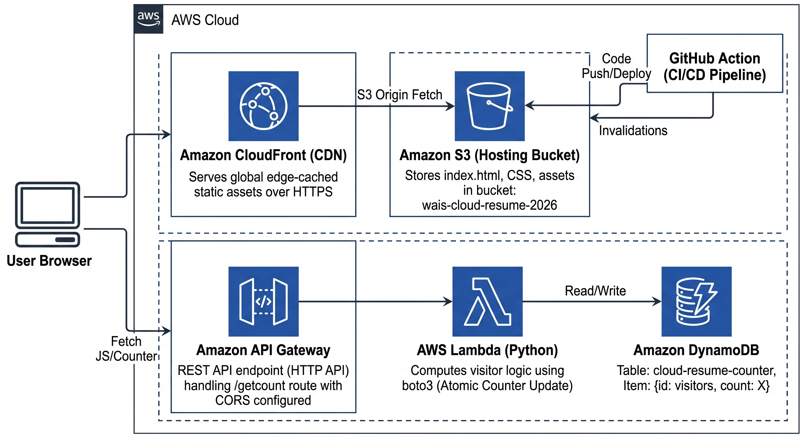

# 🚀 Cloud Resume Challenge on AWS

A production-grade serverless web application built on AWS and provisioned entirely with Terraform.

This project demonstrates modern cloud engineering practices including Infrastructure as Code (IaC), serverless computing, CI/CD automation, CDN delivery, and NoSQL database integration.

### Core Technologies

* 🏗️ Infrastructure as Code (Terraform)

* ⚡ Serverless Architecture (AWS Lambda)

* 🚀 CI/CD Automation (GitHub Actions)

* 🌍 Global Content Delivery (CloudFront)

* 💾 NoSQL Database (DynamoDB)

* 🔌 API Development (API Gateway)

---

## 🌐 Live Demo

**Website:** https://d1l6jcvu4zf64q.cloudfront.net/

**Visitor Counter API:** https://t9bxl7c440.execute-api.eu-north-1.amazonaws.com/counter

---

## ✨ Features

* Static resume website hosted on Amazon S3

* Global low-latency delivery through Amazon CloudFront

* HTTPS-secured public endpoint

* Serverless visitor counter powered by AWS Lambda

* Persistent visitor tracking with DynamoDB

* Atomic counter updates for accurate metrics

* Infrastructure fully managed with Terraform

* Automated deployments through GitHub Actions

* Automatic CloudFront cache invalidation after deployments

* Principle of Least Privilege IAM configuration

---

## 🏗️ Architecture



---

## 🏗️ Infrastructure as Code

All cloud resources are provisioned and managed using Terraform.

### Managed Resources

* Amazon S3

* Amazon CloudFront

* API Gateway

* AWS Lambda

* DynamoDB

* IAM Roles & Policies

### Benefits

* Version-controlled infrastructure

* Reproducible deployments

* Consistent environments

* Automated provisioning

* Easier maintenance and scaling

---

## 📂 Repository Structure

```text

.

├── .github/

│   └── workflows/

│       └── deploy.yml           # CI/CD pipeline

├── backend/

│   └── lambda_function.py       # Visitor counter logic

├── terraform/

│   ├── main.tf                  # Infrastructure definitions

│   ├── variables.tf

│   └── outputs.tf

├── index.html                   # Resume frontend

├── .gitignore

└── README.md

```

---

## 🛠️ Tech Stack

| Category               | Technology            |

| ---------------------- | --------------------- |

| Infrastructure as Code | Terraform             |

| CI/CD                  | GitHub Actions        |

| Frontend               | HTML, CSS, JavaScript |

| Hosting                | Amazon S3             |

| CDN                    | Amazon CloudFront     |

| API                    | Amazon API Gateway    |

| Compute                | AWS Lambda (Python)   |

| Database               | Amazon DynamoDB       |

| Security               | IAM                   |

---

## 🔌 API Specification

### POST /counter

Increments and returns the current visitor count.

### Example Response

```json

{

  "count": 95

}

```

---

## 🚀 Deployment

### Provision Infrastructure

```bash

cd terraform

terraform init

terraform plan

terraform apply

```

### Deploy Frontend

The frontend deployment process is fully automated through GitHub Actions.

Any push to the `main` branch will:

1. Upload updated assets to Amazon S3

2. Invalidate the CloudFront cache

3. Deploy changes globally

```bash

git add .

git commit -m "feat: update resume"

git push origin main

```

---

## 🔒 Security Considerations

### IAM Least Privilege

Lambda permissions are restricted to only the DynamoDB operations required by the application.

### CORS Configuration

API Gateway is configured to accept requests only from approved origins.

### HTTPS Everywhere

CloudFront provides encrypted communication between users and the application.

---

## 💡 Engineering Highlights

### Fully Serverless Design

No servers to provision, manage, or patch. AWS services scale automatically based on demand.

### Atomic Counter Updates

DynamoDB update expressions ensure accurate visitor counts even under concurrent requests.

### Infrastructure as Code

The entire environment can be recreated from source-controlled Terraform configurations.

### Automated CI/CD

GitHub Actions removes manual deployment steps and ensures consistent releases.

### Global Performance

CloudFront edge locations reduce latency and improve user experience worldwide.

---

## 📚 Skills Demonstrated

* AWS Architecture

* Infrastructure as Code (Terraform)

* Serverless Development

* CI/CD Automation

* Cloud Security

* API Development

* DynamoDB

* CloudFront

* GitHub Actions

* IAM Policy Design

---

## 🎯 Project Goal

The Cloud Resume Challenge is designed to bridge the gap between cloud certifications and real-world implementation.

This project demonstrates the ability to design, provision, automate, secure, and operate a complete serverless application using AWS best practices.

